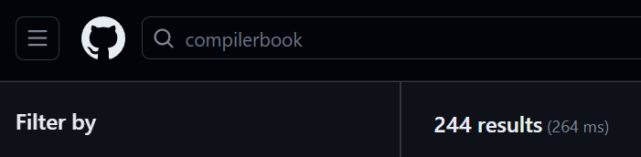

<!-- _class: title -->

# コンパイラ写経のススメ（感想）

**RICORA** 覚道健太郎

Bluesky: @kakudo.org

---

# 自己紹介

東京理科大学 創域理工学部 数理科学科 4年

**Rust**が好き

- テキストエディタとかを書いている

**Web**も好き

- しょうもなサービスを産んでは閉じている

---

# 自力でコンパイラ書けますか？

- そもそも構文解析できる？
- アセンブリでどうやって関数を作るの？
- え、そもそも変数って何なんだ･･･
- ポインタをどう表現するんですか！？

―― 僕は無理でした

---

# 書き方を教えてくれる本はあるけれど･･･

もちろん、有名な本はたくさんある

･･････けど分厚い。**かなり進めないと全容が見えない。**

**例** 『最新コンパイラ構成技法』

- 238ページまで進めてやっと基礎編終了

---

# 手取り足取り教えてもらう方法

### それが**写経**だ～！

--> さっそく有名コンパイラのコードを見てみよう！ 

---

･･････。

### 例: 主なコンパイラのコード行数


- GCC: 約**2000万**行


- LLVM: 約**3000万**行

---

# Compilerbook

Rui Ueyamaさんの公開されているオンラインブック

https://www.sigbus.info/compilerbook

- 細かく**お手本コード**がある
- **周辺知識**についても親切な記述がある
- **日本語**で書かれている（一部に重要）

コンパイラを書きながら、低レイヤに詳しくなれる！

---

# 実際進めてみる

なになに･･････最初のステップは**数字を1つコンパイルする**？なんじゃそりゃ？

### 最初のテストコード

```c
42
```

### 実行結果

```
(終了コード42でプログラムが直ちに終了する)
```

---

## インクリメンタルな開発

Compilerbookでは、**全部のステージ**で**小さなC言語が "コンパイル" できる** ようにする

教科書などでよくある、

**構文解析** -> **意味解析** -> **中間表現** -> ･･･

と各パーツを完成させていくのとは対照的。

---

## どんどん動く！

1. 数字ひとつ
2. 足し算・引き算
3. 字句解析機
4. エラーメッセージ
5. 四則演算

$$\vdots$$

9. `return`文

$$\vdots$$

---

15ステップくらいで、これくらいのコードが動くようになる

```c
int countsum(int c) {
  int sum;
  sum = 0;
  int i;
  for (i = 0; i <= c; i = i + 1) {
    sum = sum + i;
  }
  return sum;
}
int main() {
  return countsum(14);
}
```

読みながら無理なく進めているのに、いつの間にかできてしまう感覚

---

# それでもムズいときはある

Compilerbookを**進めている人**たちのコードを読もう！



たくさんの仲間が書いているので、同じ問題に勝利した人たちがいる

---

# 天才じゃない僕たちは天才の真似から始めよう

- 天才でさえ、大きなプログラムをガッと書けるわけではない（はず）
- 小さいステップで進めよう！
- テストは大事
